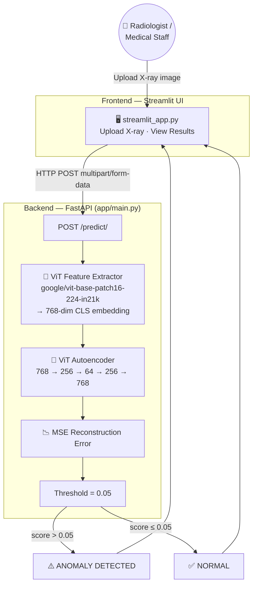
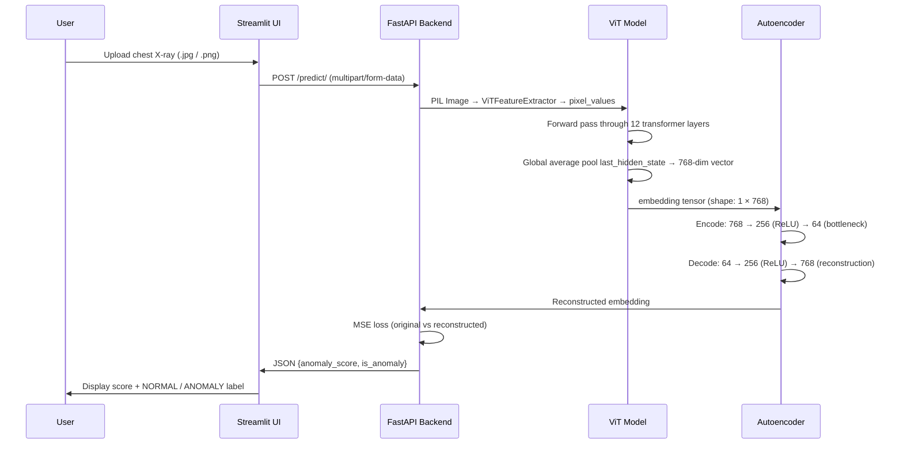
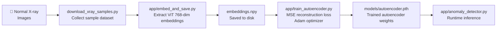
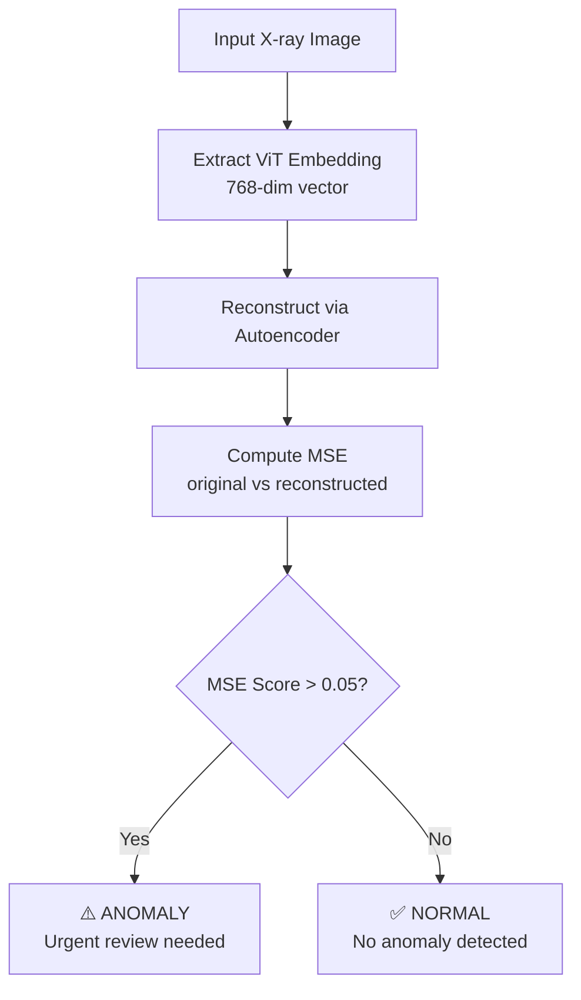

# 🩺 HealthGuard — Autonomous Anomaly Detection in Medical Imaging

<div align="center">


**HealthGuard** is an AI-powered medical imaging tool that autonomously detects anomalies in chest X-ray images using a Vision Transformer (ViT) backbone with a lightweight autoencoder for reconstruction-based anomaly scoring.

</div>

---

## 🏗️ Architecture Overview



---

## 🔄 How It Works

### 1. Prediction Pipeline (Real-time)



### 2. Autoencoder Training Pipeline (Offline)



### 3. Anomaly Scoring Logic



---

## ✨ Features

| Feature | Description |
|---|---|
| 🧠 ViT Embeddings | `google/vit-base-patch16-224-in21k` produces rich 768-dim features |
| 🔁 Autoencoder | Lightweight MLP bottleneck: 768 → 64 → 768 |
| 📉 Anomaly Scoring | MSE reconstruction error with tunable threshold (default: 0.05) |
| 🌐 REST API | FastAPI `/predict/` endpoint for image upload and scoring |
| 🖥️ Dashboard | Interactive Streamlit UI — upload, view, and get instant results |
| 🔍 Explainability | Grad-CAM saliency maps via `app/explain.py` |
| 💻 Offline Ready | Works fully offline after model weights are downloaded |

---

## 📂 Project Structure

```
healthguard/
├── app/
│   ├── main.py              # FastAPI backend — POST /predict/ endpoint
│   ├── model.py             # ViT feature extractor (google/vit-base-patch16-224-in21k)
│   ├── autoencoder.py       # ViTAutoencoder definition (768→256→64→256→768)
│   ├── anomaly_detector.py  # Standalone anomaly detection utility
│   ├── embed_and_save.py    # Extract and save ViT embeddings from X-ray dataset
│   ├── train_autoencoder.py # Train autoencoder on normal X-ray embeddings
│   └── explain.py           # Grad-CAM explainability heatmaps
├── data/                    # X-ray image samples (populated by download script)
├── models/
│   └── autoencoder.pth      # Trained autoencoder weights (generated by training)
├── download_xray_samples.py # Dataset preparation and download script
├── streamlit_app.py         # Streamlit frontend dashboard
├── test_predict.py          # API endpoint test script
└── requirements.txt         # Python dependencies
```

---

## 🚀 Quick Start

### 1. Clone & Install

```bash
git clone https://github.com/mayanksinghraghav/healthguard.git
cd healthguard
python -m venv venv
source venv/bin/activate        # macOS / Linux
# venv\Scripts\activate         # Windows
pip install -r requirements.txt
```

### 2. Prepare Data & Train Autoencoder

```bash
# Download sample X-ray images
python download_xray_samples.py

# Extract ViT embeddings from normal X-rays
python app/embed_and_save.py

# Train the autoencoder on normal embeddings
python app/train_autoencoder.py
# → Saves: models/autoencoder.pth
```

### 3. Start the FastAPI Backend

```bash
uvicorn app.main:app --reload
# API docs: http://127.0.0.1:8000/docs
```

### 4. Launch the Streamlit Dashboard

```bash
streamlit run streamlit_app.py
# → Opens: http://localhost:8501
```

Upload any chest X-ray and receive an instant anomaly score with NORMAL / ANOMALY classification.

---

## 🧪 Test the API

```bash
python test_predict.py
```

Or with `curl`:

```bash
curl -X POST "http://127.0.0.1:8000/predict/" \
  -F "file=@chest_xray.jpg"
```

Response:

```json
{
  "anomaly_score": 0.0312,
  "is_anomaly": false
}
```

---

## 🛠️ Tech Stack

| Component | Technology |
|---|---|
| Vision Encoder | `google/vit-base-patch16-224-in21k` (HuggingFace) |
| Anomaly Model | Custom MLP Autoencoder (PyTorch) |
| Framework | HuggingFace Transformers 4.41 |
| API Server | FastAPI 0.110 + Uvicorn 0.29 |
| Frontend | Streamlit 1.35 |
| Explainability | Grad-CAM (`app/explain.py`) |
| Image Processing | Pillow 10.3 + OpenCV headless |
| Numerics | NumPy 1.26 + scikit-learn 1.5 |

---

## 📊 Model Details

```
Vision Encoder (ViT):
  Model:       google/vit-base-patch16-224-in21k
  Input:       224 × 224 RGB image
  Patch size:  16 × 16 (→ 196 patches + [CLS] token)
  Output:      768-dim embedding via global average pooling

Autoencoder (MLP):
  Encoder:     768 → Linear(256) → ReLU → Linear(64)
  Bottleneck:  64-dim latent representation
  Decoder:     64 → Linear(256) → ReLU → Linear(768)
  Loss:        MSE reconstruction error
  Threshold:   0.05 (configurable)
```

---

## 🔬 Anomaly Score Interpretation

| Score Range | Interpretation |
|---|---|
| `0.00 – 0.02` | Clearly normal X-ray |
| `0.02 – 0.05` | Borderline — manual review advised |
| `> 0.05` | ⚠️ Anomaly detected — urgent radiologist review |

> **Disclaimer:** HealthGuard is a triage assist tool only. All results must be reviewed and confirmed by a qualified radiologist before clinical use.

---

> Built to support early detection and faster triage in resource-constrained medical settings.
